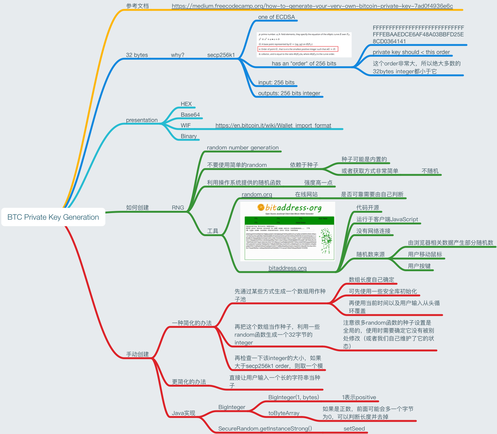

Kotlin Btc Key Generator Demo
=============================

一些线索

- 一个private key实际上是一个随机的很大的数字（长度为160的巨大数字），其值 1 <= key < `0xFFFFFFFFFFFFFFFFFFFFFFFFFFFFFFFEBAAEDCE6AF48A03BBFD25E8CD0364141`
- 选定了private key，可以通过secp256k1算法，得到它的public key
- 一个private key只能有一个public key。但是在bitcoin中，这个public key有两种格式（压缩与非压缩），看起来像是有两个public key

Run `Hello.kt` in your IDE.

参考文章

- 如何手动创建btc private key: <https://medium.freecodecamp.org/how-to-generate-your-very-own-bitcoin-private-key-7ad0f4936e6c>

